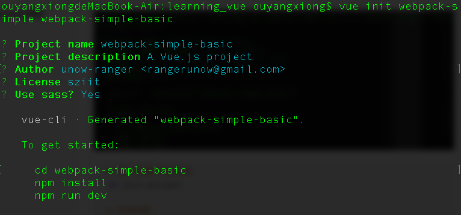
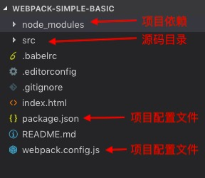
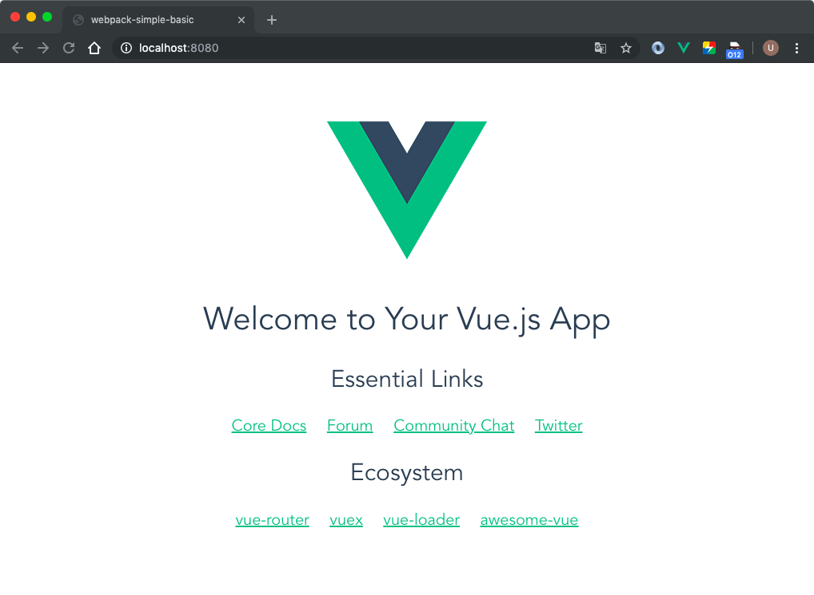
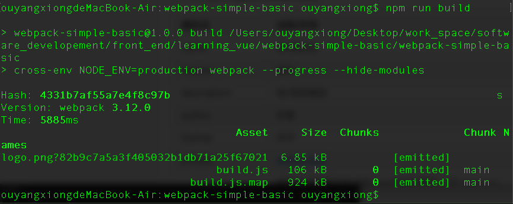
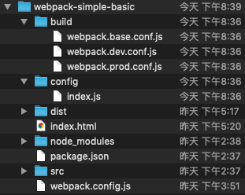
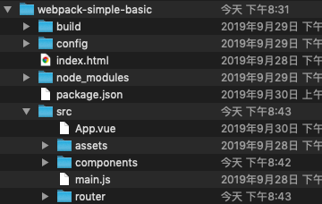

# webpack-simple-basic

本项目以webpack-simple-template为模版，逐步讲解关于vue-webpack项目中的使用到的技术，以及其配置文件中的内容解析，同时在讲解基础上逐步改造原项目，由浅至深，在开发过程中，根据需求逐步安装相应的模块和解释其作用。

同时，在着手开发之前，请确认环境搭建已完备（node，vue-cli），也需要简单了解相关webpack知识、es6语法。

> 若有说法不当之处，请指点一二，谢谢🙏

## 1. 搭建项目
### 1.1. webpack-simple模版

- **创建基础项目模版**

进入终端（cmd），命令输入
```bash
# 创建 vue-webapck-simple-template，后续会弹出一系列确认信息，一致回车通过
vue init webpack-simple your-project
```

```bash
# 进入新建的项目目录
cd your-project

# 安装依赖
npm install
```


此时项目目录如下：



- **helloWorld测试**

进入终端（cmd），命令输入

```bash
npm run dev
```

此时浏览器弹出以下页面，即第一个HelloWorld运行成功。



- 打包测试

进入终端（cmd），命令输入

```bash
npm run build
```

输出内容如下，且项目目录出现dist目录，即打包成功（无法直接通过打开index.html查看效果，需要将index.html和dist目录一齐在放置HTTP server服务器上才可查看效果）。




### 1.2. 简单了解大致配置信息

#### 1.2.1. package.json

1. **简介**

   通常是用npm init/vue init 创建一个npm项目时，会自动生成一个package.json文件。package.json文件会描述这个NPM包的所有相关信息，包括作者、简介、包依赖、构建等信息。

2. **关于package.json的相关属性**

| 属性名          | 说明/作用                                                    |
| --------------- | ------------------------------------------------------------ |
| name            | 包/项目名                                                    |
| version         | 版本                                                         |
| description     | 包/项目描述                                                  |
| author          | 作者                                                         |
| license         | 许可                                                         |
| private         | [私有包/项目](https://blog.csdn.net/guolinengineer/article/details/84334914) |
| scripts         | 指定了运行脚本命令的npm命令行缩写。如 npm run dev、npm run build等 |
| dependencies    | 生产环境依赖包列表。它们将会被安装在 node_module 目录下      |
| devDependencies | 开发环境依赖包列表。它们将会被安装在 node_module 目录下      |
| browserslist    | [代表这个项目的浏览器兼容情况](https://www.jianshu.com/p/bd9cb7861b85) |

#### 1.2.2. webpack.config.js

1. **简介**

   webpack在对象执行打包构建的时候，除了在命令行传入参数，还可以通过指定的配置文件来执行。默认会搜索当前目录下webpack.config.js。

   因此我们可以通过将配置项信息在配置文件中定义，本项目中的webpack.config.js的功能则在于此。

   根据以下代码所示，我们可知道，webpack.config.js是一个node.js 模块，返回一个 json 格式的配置信息对象。

   ```js
   /** webpack.config.js **/
   var path = require('path')
   var webpack = require('webpack')
   
   module.exports = {
     entry: './src/main.js',
     output: {
       path: path.resolve(__dirname, './dist'),
       publicPath: '/dist/',
       filename: 'build.js'
     },
       ...
   }
   ```


2. **具体配置项信息**

- **entry - 入口文件**

  ```js
  {
      //方式1. 单入口 
      entry: './src/main.js',
      //方式2. 单入口
      entry: path.resolve(__dirname,'./src/main.js'),
  	//方式3. 单/多入口
      entry: ['./main.js', 'header.js'],
      //方式4. 单/多入口
      entry: {
      	'a': './main.js',
          ....    
      },
      //方式5. 单/多入口
      entry: () => new Promise((resolve)=>resolve(['./main.js','./header.js'])) 
  }
  ```

  入口是Webpack打包的起始文件，会顺着起始文件逐步构建依赖。

  

- **output - 打包出口文件**

  ```js
  {
  	output: {
          // node.js中__dirname变量获取当前模块文件所在目录的完整绝对路径 
          // path 所有输出文件的目标路径
          path: path.resolve(__dirname, './dist'),
          // publicPath输出解析文件的目录    
          publicPath: '/dist/',
          // 对应entry里面生成出来的文件名
          filename: 'build.js'
        },
  }
  ```


- **module - 设置对相应的模块使用相应的处理**

  ```js
  {
      module: {
          rules: [
            {
              // 正则表达式匹配 .css结尾的模块文件
              test: /\.css$/,
              // 使用指定的加载器处理对该模块进行处理
              use: [
                'vue-style-loader',
                'css-loader'
              ],
            },
             ...
          ]
      }
  }
  ```

- **resolve - 补全文件后缀**

  ```js
  {
      resolve: {
          
          alias: {
            'vue$': 'vue/dist/vue.esm.js'
          },
          extensions: ['*', '.js', '.vue', '.json']
      },
  }
  ```

  配置resolve 的 extensions 可以带来的方便是不需要指定加载的文件后缀，比如要加载一个js文件时，只要require(‘common’)就可以加载common.js文件了，例如：

  ```js
  import Hello from '@components/Hello';
  // 即Hello.vue这个组件我们不需要添加.vue后缀就可以引用到了，如果不用extensions，我们就必须要用@components/Hello.vue来引入这个文件。
  ```

  配置resolve 的 alias  带来的方便是 使 不同路径下的组件相互调用变得更加简单，比如：

  ```js
  // 假如在目录src/hello/world/ 下的组件要调用 src/components下的组件comp1，需要这么写。
  import Comp1 from '../../components/comp1';
  // 路径相对于当前页面进行引用，但是如果嵌套等更为复杂，那么写起来会比较麻烦。
  // 若配置了一下信息：
  alias: {
            '@': 'src/components'
          },
  // 那么导入只需要这么写
  import Comp1 from '@/comp1';
  ```

- **devServer - 对webpack-dev-server进行配置**

  ```js
  {
      devServer: {
          historyApiFallback: true,
          noInfo: true,
          overlay: true
          //...
      },
  }
  ```

  webpack-dev-server是一个用来快速搭建本地运行环境的工具，命令简单**webpack-dev-server**或配置命令脚本快捷运行。

  ```bash
  # 前面我们通过运行脚本 npm run dev 实质上是运行了webpack-dev-server命令
  npm run dev 
  
  # 打开package.json, 可在scripts配置项中看到，实际是运行这一条命令
  cross-env NODE_ENV=development webpack-dev-server --open --hot
  # 我们可看到，该条命令传入了2个参数， 没有指明 webpack.config.js配置文件，那么它默认在当前目录下查看webpack.config.js
  ```

  webpack-dev-server主要的作用是用来 模拟服务器运行情况，进行上线前调试等。

  <a href="#关于webpack-dev-server">关于webpack-dev-server的参数设置详细，点击此处查看</a>

- **performance -  配置如何展示性能提示**

  ```js
  {
      performance: {
          // 不显示性能提示
          hints: false
      }
  }
  ```

- **devtool - 指定sourceMap模式**

  ```js
  {
        devtool: '#eval-source-map'
  }
  ```

  根据官方回答，*Choose a developer tool to enhance debugging.* 即选择一种调试代码的方式。可参考[官方文档](https://www.webpackjs.com/configuration/devtool/)。

- **关于生产环境打包脚本**

  在配置文件末尾可看到，存在这么一段脚本，该段脚本的功能是当webpack执行打包属于生产环境下的，那么就新增和修改一些配置项。

  ```js
  // 判断命令行传递的参数是否指定生产环境打包
  if (process.env.NODE_ENV === 'production') {
    // 跟换devtool
    module.exports.devtool = '#source-map'
    // 新增plugins插件配置项，后续说明
    module.exports.plugins = (module.exports.plugins || []).concat([
      new webpack.DefinePlugin({
        'process.env': {
          NODE_ENV: '"production"'
        }
      }),
      new webpack.optimize.UglifyJsPlugin({
        sourceMap: true,
        compress: {
          warnings: false
        }
      }),
      new webpack.LoaderOptionsPlugin({
        minimize: true
      })
    ])
  }
  ```

  我们通过打开package.json在看scripts配置项可知：

  ```bash
  # 项目生产环境打包命令
  npm run build
  # 实质上是运行了这条命令 
  # --hide-modules 隐藏有关模块的打包信息
  # --progress 显示打包进程
  cross-env NODE_ENV=production webpack --progress --hide-modules
  ```

  其中，**cross-env NODE_ENV=production ** 指定了 环境变量NODE_ENV = production，声明此次执行属于生产环境。


## 2. 修改模版

### 2.1. 整改webpack配置文件

我们可以看到，webpack-simple的所有wepack配置项都放在webpack.config.js中，显然，在小项目中是可行的，但是转移到一个拥有繁多的开发环境配置项、生产环境配置项的庞大的项目上，则需要明确划分好webpack配置文件。

#### 2.1.1. 整改准备

- 在项目根目录下新建目录build，及config
- 在config目录下创建文件index.js
- 在build目录下创建文件webpack.dev.conf.js、webpack.prod.conf.js、webpack.base.js

> -- config						#存放配置项变量
>
>  |-- index.js						##定义主要配置变量文件
>
> -- build						#引用config中的配置项变量和定义基本配置项
>
>  |-- webpack.base.js				##定义生产环境和开发环境共同需要的配置项
>
>  |-- webpack.dev.conf.js			##定义开发环境所需要的配置项信息
>
>  |-- webpack.prod.conf.js			##定义生产环境所需要的配置项信息



#### 2.1.2. 拆分webpack.config.js

```bash
# 后面拆分webpack配置文件，通过使用webpack-merge进行拼接多个子配置配置文件
npm install webpack-merge@4.1.0 --save-dev
```


#### 2.1.3. 配置config/index.js

```js
/** index.js **/

'use strict'
const path = require('path')

module.exports = {
  /* 通用配置项 */
    // 项目路径
  context: path.resolve(__dirname, '../'), 
  entry: './src/main.js',
  filename: 'build.js',

  // 开发环境配置变量
  dev: {
    /* devServer 配置项参数 */
    host: 'localhost',
    port: 8080,
    historyApiFallback: true,
    noInfo: true,
    overlay: true,

  },
  // 生产环境配置变量
  build: {
    /* 打包路径 */
    assetsRoot: path.resolve(__dirname, '../dist'),
    assetsSubDirectory: 'static',
    assetsPublicPath: '/',
    devtool: '#source-map',
  }
}
```

#### 2.1.4. 配置build/webpack.base.conf.js

```js
/** webpack.base.conf.js **/
/**
 *  定义通用配置项的配置文件
 */
'use strict'
const config = require('../config')
const path = require('path')

module.exports = {
  context: config.context,
  entry: {
    app: config.entry,
  },
  output: {
    path: config.build.assetsRoot,
    publicPath: config.build.assetsPublicPath,
    filename: config.filename,
  },
  resolve: {
    alias: {
      'vue$': 'vue/dist/vue.esm.js',
      '@': path.resolve(__dirname,'../src'),
    },
    extensions: ['*', '.js', '.vue', '.json']
  },
  module: {
    rules: [
      {
        test: /\.css$/,
        use: [
          'vue-style-loader',
          'css-loader'
        ],
      },
      {
        test: /\.scss$/,
        use: [
          'vue-style-loader',
          'css-loader',
          'sass-loader'
        ],
      },
      ...
    ]
  },
  plugins:[],
  performance: {
    hints: false
  },
}
```

#### 2.1.5. 配置build/webpack.dev.conf.js

```js
/** webpack.dev.conf.js **/
/**
 *  开发环境下的所有配置项集中在此文件中
 */
'use strict'
const config = require('../config')
const baseWebpackConfig = require('./webpack.base.conf')
const merge = require('webpack-merge')

// 将开发环境特有的配置项和通用配置项合并
const devWebpackConfig = merge(baseWebpackConfig, {
  devServer: {
    host: config.dev.host,
    port: config.dev.port,
    historyApiFallback: config.dev.historyApiFallback,
    noInfo: config.dev.noInfo,
    overlay: config.dev.overlay,
  },
  devtool: '#eval-source-map',
  plugins: baseWebpackConfig.plugins
})

module.exports = devWebpackConfig
```

#### 2.1.6. 配置build/webpack.prod.conf.js

```js
/** webpack.prod.conf.js **/

/**
 *  生产环境下的所有配置项集中在此文件中
 */
'use strict'
var webpack = require('webpack')
const baseWebpackConfig = require('./webpack.base.conf')
const merge = require('webpack-merge')

// 将生产环境特有的配置项和通用配置项合并
const webpackConfig = merge(baseWebpackConfig, {
  devtool: '#source-map',
  plugins: (baseWebpackConfig.plugins || []).concat([
    new webpack.DefinePlugin({
      'process.env': {
        NODE_ENV: '"production"'
      }
    }),
    new webpack.optimize.UglifyJsPlugin({
      sourceMap: true,
      compress: {
        warnings: false
      }
    }),
    new webpack.LoaderOptionsPlugin({
      minimize: true
    })
  ]) 
})

module.exports = webpackConfig
```

#### 2.1.7. 更改package.json

引用指定的配置文件。

```json
"scripts": {
    "dev": "cross-env NODE_ENV=development webpack-dev-server --config build/webpack.dev.conf.js --open --hot",
    "build": "cross-env NODE_ENV=production webpack --config build/webpack.prod.conf.js --progress --hide-modules"
  }
```


#### 2.1.8. 测试

到这里，配置文件的拆分基本完成，同样的，输入命令测试开发环境配置和生产环境配置。 同时项目根目录下的webpack.config.js已经完全被我们划分的配置文件取代了，可将其删除。

```bash
npm run dev
npm run build
```


### 2.2. 模块组件化

#### 2.2.1. 关于模块组件化开发

- 页面上的每个独立的、可视/可交互区域视为一个组件;

- 每个组件对应一个工程目录,组件所需的各种资源都在这个目录下就近维护;

- 由于组件具有独立性,因此组件与组件之间可以 自由组合;

- 页面只不过是组件的容器,负责组合组件形成功能完整的界面;


#### 2.2.2. 整改准备

- 在src目录下创建文件夹components
- 在src目录下创建文件夹router

> -- src
>
> |---- components						#存放组件模块
>
> |---- router							#存放路由管理器。



#### 2.2.3. 创建模块

将原来的App.vue文件中的html内容，作为一个组件分离出来，并将这个组件命名为HelloWorld。

- 在components下创建文件夹HelloWorld，进入HelloWorld目录，创建index.vue

> --src
>
> |---- components
>
> |------ HelloWorld
>
> |-------- index.vue

- 将App.vue中的内容分离出来，粘贴到index.vue中

```vue
<template>
  <div id="app">
    
    <h1>{{ msg }}</h1>
    <h2>Essential Links</h2>
    <ul>
      <li><a href="https://vuejs.org" target="_blank">Core Docs</a></li>
      <!-- ....  -->
    </ul>
  </div>
</template>
<script>
export default {
  name: 'HelloWorld',
  data () {
    return {
      msg: 'Welcome to Your Vue.js App'
    }
  }
}
</script>
<style lang="scss">
<!-- .... -->

</style>

```


#### 2.2.4. 路由配置

-   **关于路由配置器vue-router**

   Vue Router 是 Vue.js 官方的路由管理器。它和 Vue.js 的核心深度集成，让构建单页面应用变得易如反掌。包含的功能有：**嵌套的路由/视图表；模块化的、基于组件的路由配置；路由参数、查询、通配符；基于 Vue.js 过渡系统的视图过渡效果；细粒度的导航控制；带有自动激活的 CSS class 的链接；HTML5 历史模式或 hash 模式，在 IE9 中自动降级；自定义的滚动条行为。**

- **安装vue-router**

  ```bash
  cnpm install --save vue-router@3.0.1
  ```

- **配置路由管理器**

  在router路径下创建文件index.js

  编辑index.js

  ```js
  import Vue from 'vue'
  import Router from 'vue-router'
  // 引用独立组件
  import HelloWorld from '@/components/HelloWorld'
  
  // 通过全局方法 Vue.use() 使用vue-router插件
  Vue.use(Router)
  
  export default new Router({
    // 配置路由，路由映射组件
    routes: [
      {
        path: '/HelloWorld',
        name: 'HelloWorld',
        component: HelloWorld
      }
    ]
  })
  ```


#### 2.2.5. 整改App.vue

```vue
<template>
  <div id="app">
    
    <!-- 使用来挂载切换的视图 -->
    <router-view/>
  </div>
</template>

<script>
export default {
  name: 'App'
}
</script>
<style>

</style>
```


#### 2.2.6. 整改main.js

```js
import Vue from 'vue'
import App from './App.vue'
import router from './router'

//vue 实例
new Vue({
  //表示用<app></app>替换index.html里面的<div id="app"></div>
  el: '#app',
  // 将路由器对象引入全局this，即this.$router
  router,
  // 实例使用App组件
  components: { App },
  // 使用app组件作为模版
  template: '<App/>'
})
```


#### 2.2.7. 测试

```bash
# 在浏览器中访问 localhost:8080/#/HelloWorld
npm run dev

npm run build
```

最后，经过组合化开发规范后，大致开发步骤如下：

- 假设在某个场景下，我们需要开发一个新的组件Comp1，并且添加到vue实例中：

  1. 在components目录下创建组件目录Comp1，进入Comp1目录创建主文件index.vue

  2. 编辑index.vue

  3. 将编辑好的组件添加路由管理器，为其配置映射路径，在router/index.js中导入并配置，如下：

     ```js
     import Vue from 'vue'
     import Router from 'vue-router'
     import HelloWorld from '@/components/Comp1'
     Vue.use(Router)
     
     export default new Router({
       routes: [
         {
           //在浏览器中访问 localhost:8080/#/Comp1即可访问到这个组件
           path: '/Comp1',
           name: 'Comp1',
           component: Comp1
         }
       ]
     })
     ```


## 关于webpack-dev-server

1. **webpack-dev-server是什么？**
   webpack-dev-server是一个轻量级的服务器，修改文件源码后，自动刷新页面将修改同步到页面上。

2. **关于启动webpack-dev-server**

   **启动webpack-dev-server有两种方式，分别为 cmd line 形式 和 Node.js API形式，本项目展示第一种。**

- 安装webpack-dev-server

  ```bash
  # 这里根据本项目的安装的模块，安装相应的指定的版本
  npm install --save-dev webpack-dev-server@2.9.1
  ```

- 在package.json中配置scripts

  ```json
  "scripts":{
      "dev":"webpack-dev-server --config webpack.config.dev.js"
  }
  ```

> --config webpack.config.dev.js 指定对应的开发环境配置参数文件

- 命令行中输入命令启动

  ```bash
  npm run dev
  ```

3. **关于webpack-dev-server配置参数**

   > 以下参数可在webpack.dev.conf.js配置文件中 devServer 项内配置

   | 参数                                 | 说明                                                         |
   | ------------------------------------ | ------------------------------------------------------------ |
   | quiet {Boolean}                      | 控制台中不输出打包的信息，开发中一般设置为false，进行打印，这样查看错误比较方面 |
   | no-info {Boolean}                    | 启用 noInfo 后，诸如「启动时和每次保存之后，那些显示的 webpack 包(bundle)信息」的消息将被隐藏。错误和警告仍然会显示 |
   | compress {Boolean}                   | 是否开启gzip压缩。默认为false，不开启                        |
   | host {ip}                            | 指定使用一个 host ip。默认是 localhost                       |
   | port {Number}                        | 设置端口号，默认是:8080                                      |
   | inline {Boolean}                     | 在 dev-server 的两种不同模式之间切换。默认情况(true)下，应用程序启用内联模式(inline mode)。这意味着一段**处理实时重载的脚本**被插入到包(bundle)中，并且构建消息将会出现在浏览器控制台。也可以使用iframe (false) 模式，它在通知栏下面使用`<iframe>` 标签，包含了关于构建的消息 |
   | before {Function}                    | 提供在服务器内部所有其他中间件之前执行自定义中间件的能力。可用作接口调试 |
   | proxy {Object}                       | 假若单独的后端开发服务器 API，并且希望在同域名下发送 API 请求。http可做HTTP代理 |
   | hot {Boolean}                        | 是否开启热替换。默认为false，不开启（**若开启，插件必须要开启new webpack.HotModuleReplacementPlugin()**） |
   | open {Boolean}                       | 是否自动打开浏览器。默认为false，不开启                      |
   | contentBase {Boolean\|Array\|String} | 告诉服务器从哪里提供内容，如果不进行设定的话，默认是在当前目录下。只有在你想要提供静态文件时才需要。 |
   | overlay {Boolean\|Object}            | 当有编译器错误或警告时，在浏览器中显示全屏覆盖。值为true时，只显示报错 |
   | clientLogLevel {String}              | 当使用内联模式(inline mode)时，在开发工具的控制台将显示消息的等级。默认值为 info，可选值none, error, warning 或者 info |

   例如：

   ```js
   module.exports = {
       devServer: {
           clientLogLevel: 'warning',
           hot: true,
           contentBase: false, 
           compress: true,
           host: HOST || config.dev.host,
           port: PORT || config.dev.port,
           open: config.dev.autoOpenBrowser,
           overlay: config.dev.errorOverlay
             ? { warnings: false, errors: true }
             : false,
           publicPath: config.dev.assetsPublicPath,
           proxy: config.dev.proxyTable,
           quiet: true, 
         },
   }
   ```

   

4. **关于webpack-dev-server的命令行参数**

   | 参数       | 说明                     |
   | ---------- | ------------------------ |
   | --progress | 显示打包的进度           |
   | --compress | 开启gzip压缩             |
   | --quiet    | 控制台中不输出打包的信息 |
   | --inline   | 实时刷新                 |
   | --config   | 指定配置文件             |

5. **关于inline 和 hot**

- **hot**，webpac-dev-server支持Hot Module Replacement (HRM)，即模块热替换，在前端代码变动的时候无需整个刷新页面，只把变化的部分替换掉。

- **inline**，inline选项会为入口页面添加“热加载”功能，即代码改变后重新加载页面。

  例如：

  ```bash
  #1. 不会刷新浏览器
  webpack-dev-server
  #2. 刷新浏览器
  webpack-dev-server --inline
  #3. 重新加载改变的部分，不会刷新页面
  webpack-dev-server --hot
  #4. 重新加载改变的部分，HRM失败则刷新页面
  webpack-dev-server  --inline --hot
  
  ```

- [关于 inline 的具体原理机制 及 其他相关内容](https://www.cnblogs.com/videring/articles/7641555.html)


## 关于cross-env

1. **回顾package.json的scripts**

   ```json
   "scripts": {
       "dev": "cross-env NODE_ENV=development webpack-dev-server --config build/webpack.dev.conf.js --open --hot",
       "build": "cross-env NODE_ENV=production webpack --config build/webpack.prod.conf.js --progress --hide-modules"
     },
   ```

   我们可以发现，开发环境调试命令和打包命令前都有这么一条命令**`cross-env NODE_ENV=`**。


2. **NODE_ENV**

   **NODE_ENV=** 是设置环境变量，如**NODE_ENV=development**，他可以作为一个标识，来匹配对应的一些配置。


3. **cross-env**

   由于在不同的操作系统下，其环境变量配置方式可能不同，所以cross-env是实现运行跨平台设置和使用环境变量的脚本，cross-env使得您可以使用单个命令，而不必担心为平台正确设置或使用环境变量。 


